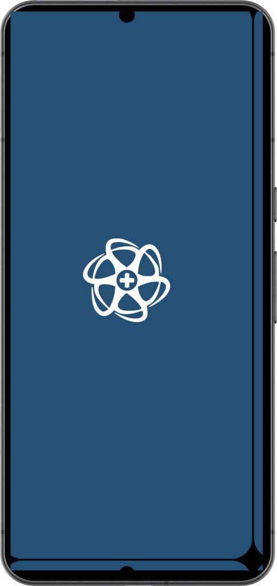
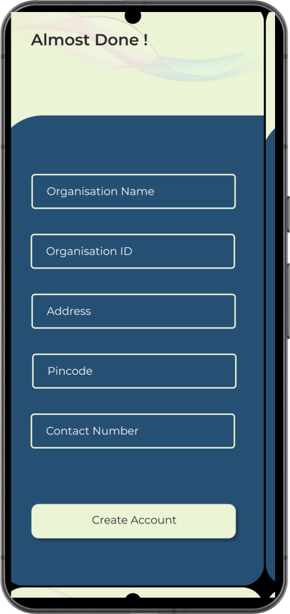
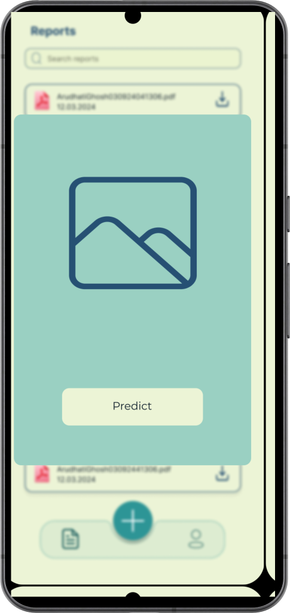
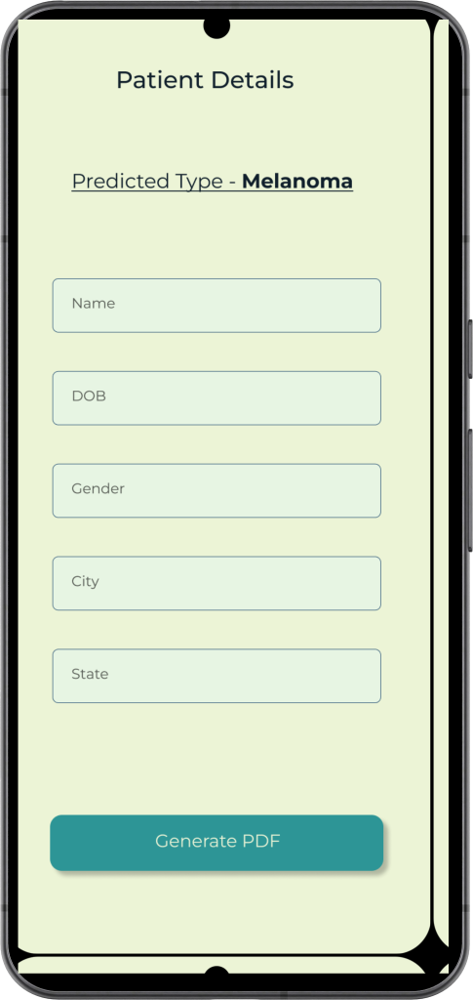

<!-- Add image banner here -->

 

<h1 align = "center">Prognosis AI</h1>
Skin cancer is the out-of-control increase of odd cells within the epidermis, the outermost skin layer, because of unrepaired DNA damage that triggers mutations. These mutations lead the skin cells to multiply rapidly and shape malignant tumors. Melanoma is the most dangerous type of skin cancer, whose  incidence has increased dramatically over the past 50 years. In fact, it is one of the most common cancers in terms of mortality. Early detection stands as a pivotal factor influencing the successful treatment and improved diagnosis of skin cancer. 
Built by integrating an ensemble deep learning model, CNN-RF (Convolutional Neural Network-Random Forest) to classify the images and predict the cancer type, Prognosis AI is meant to be used by registered hospitals to predict the skin cancer type of the patients. The app also displays a report of the patient’s results along with the hospital and patient details. The report can also be downloaded in pdf format.

## Developed Using 🛠
- [Python](https://www.python.org/) - Python, when used in machine learning, offers developers of all skill sets exceptional versatility and predictive power.
- [Keras](https://keras.io/) - Keras is a high-level, deep learning API developed by Google for implementing neural networks. It is written in Python and is used to make the implementation of neural networks easy.
- [Tensorflow](https://www.tensorflow.org/) - TensorFlow is an open-source library developed by Google primarily for deep learning applications.
- [Tensorflow Lite](https://www.tensorflow.org/lite/android) - TensorFlow Lite is a set of tools that enables on-device machine learning by helping developers run their models on mobile, embedded, and edge devices.
- [Kotlin](https://developer.android.com/kotlin/first) - Google's preferred language for Android app development.
- [Coroutines](https://kotlinlang.org/docs/coroutines-overview.html) - For asynchronous calls and tasks to utilize threads.
- [Jetpack Navigation](https://developer.android.com/guide/navigation) - A powerful navigation component provided by Android Jetpack, facilitating seamless navigation between destinations in your app's user interface.
- [Firebase](https://firebase.google.com/) - Firebase is a Backend-as-a-Service (BaaS) app development platform that provides hosted backend services. Integrated the Firebase Realtime Database and Authentication into the app.
- [Hilt](https://developer.android.com/training/dependency-injection/hilt-android) - Jetpack's recommended dependency injection library, simplifying the process of providing dependencies throughout your app.

## The Dataset used 📋
<b>Skin Cancer MNIST: HAM10000</b>, a large collection of multi-source dermatoscopic images of pigmented lesions with over 10,000 skin cancer images is used from Kaggle. Cases include a representative collection of all important diagnostic categories in the realm of pigmented lesions: Actinic keratoses and intraepithelial carcinoma / Bowen's disease (akiec), basal cell carcinoma (bcc), benign keratosis-like lesions (solar lentigines / seborrheic keratoses and lichen-planus like keratoses, bkl), dermatofibroma (df), melanoma (mel), melanocytic nevi (nv) and vascular lesions (angiomas, angiokeratomas, pyogenic granulomas and hemorrhage, vasc).

## CNN-RF used and why❔
Various popular neural network architectures were utilised to build the respective models and the test results were compared. CNN-RF provided the best accuracy on test data among the six different models. Hence, the CNN-RF TensoFlow model was chosen to be integrated in the end-to-end android application, Prognosis AI.
The accuracy results on the test data were as follows:
| Model                | Test Accuracy |
|----------------------|---------------|
| VGG-16               | 80%           |
| ResNet               | 81%           |
| DenseNet             | 83%           |
| InceptionV3          | 84%           |
| MobileNetV3          | 86%           |
| CNN with Random Forest | 96%         |

## Model Integration 💻
The TensorFlow model was converted to a TensorFlow Lite model. It was then integrated to the android app. 

## Screenshots 📱

  
  
  
  
  
  
  
  
  
  
  

## Video 📽

  
https://github.com/GeekLord04/Prognosis-AI/assets/84928799/0c31c450-9b94-4833-91e4-93b8212b3085

